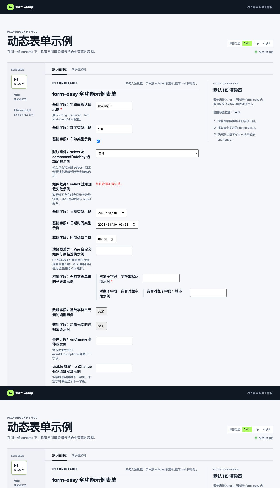
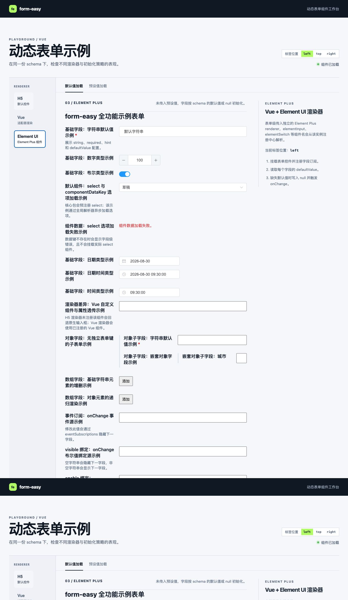

# form-easy ✨

**一个由 JSON 驱动的动态表单组件库。** `form-easy` 使用 Stencil 构建为标准 Web Components，可在任意前端项目中使用；`form-easy-vue` 则提供 Vue 3 渲染器、独立组件注册中心以及 Element Plus 适配工厂。

> 🧩 一份 schema，按需选择原生 H5、Vue 或第三方 UI 库渲染器。

## 特性 🚀

- 📝 支持字符串、数字、布尔、日期、日期时间和时间基础字段。
- 🌳 支持对象字段与可增删的数组字段，并自动递归渲染。
- 🎛️ 支持默认值与预设值加载；初始化会统一触发字段 `onChange`。
- 🔗 支持字段事件订阅、`visible` / `enable` / `value` 绑定及自定义 resolver。
- 🔄 内置事件流循环检测，避免订阅配置意外形成无限循环。
- 🎨 支持表单级渲染器，默认 H5、Vue 与 Element Plus 实例可同时存在。
- 📐 支持 `left`、`top`、`right` 三种标签位置。

## 包说明 📦

| 包 | 用途 | 是否发布 |
| --- | --- | --- |
| [`@wenzhencn/form-easy`](./packages/form-easy) | 核心 Web Components、schema 类型、事件与默认 H5 渲染 | ✅ |
| [`@wenzhencn/form-easy-vue`](./packages/form-easy-vue) | Vue 3 渲染器与 Element Plus 适配工厂 | ✅ |
| [`form-easy-vue-playground`](./packages/form-easy-vue-playground) | 本地交互式示例 | ❌ |

## 安装 💿

### 原生 H5 / 任意框架

```bash
npm install @wenzhencn/form-easy
```

### Vue 3

```bash
npm install @wenzhencn/form-easy @wenzhencn/form-easy-vue vue
```

### Vue 3 + Element Plus

`form-easy-vue` 不会安装或打包 Element Plus。请由业务项目自行选择版本、安装组件库与引入样式：

```bash
npm install @wenzhencn/form-easy @wenzhencn/form-easy-vue vue element-plus
```

## 快速开始 ⚡

### 1. 注册 Web Components

在应用启动入口注册一次即可：

```ts
import { defineCustomElements } from '@wenzhencn/form-easy/loader';

defineCustomElements();
```

### 2. 编写 schema 并渲染

```ts
const schema = {
  key: 'profile',
  name: '个人资料',
  labelPosition: 'left',
  fields: [
    {
      key: 'nickname',
      name: '昵称',
      category: 'basic',
      dataType: 'string',
      required: true,
      defaultValue: 'form-easy'
    },
    {
      key: 'enabled',
      name: '启用状态',
      category: 'basic',
      dataType: 'boolean',
      defaultValue: true
    }
  ]
};

const form = document.querySelector('form-easy');
form.schema = schema;
form.addEventListener('formChange', event => {
  console.log(event.detail);
});
```

```html
<form-easy></form-easy>
```

## Vue 3 使用方式 💚

Vue 模板中请使用 `.prop`，将对象和渲染器实例作为 DOM Property 而非字符串属性传入：

```vue
<script setup lang="ts">
import { defineCustomElements } from '@wenzhencn/form-easy/loader';

defineCustomElements();

const schema = {
  key: 'profile',
  name: '个人资料',
  fields: []
};
</script>

<template>
  <form-easy :schema.prop="schema" />
</template>
```

### 创建独立 Vue 渲染器

每个 Vue 渲染器都有独立的组件注册中心。适合不同业务表单使用不同组件映射，彼此不会冲突：

```ts
import { createVueBasicFieldRenderer } from '@wenzhencn/form-easy-vue';
import UserNameInput from './UserNameInput.vue';

const userRenderer = createVueBasicFieldRenderer();
userRenderer.registerFieldComponent('userNameInput', UserNameInput);
```

```vue
<form-easy
  :schema.prop="schema"
  :basicFieldRenderer.prop="userRenderer"
/>
```

schema 中配置 `component: 'userNameInput'` 后，渲染器会将 `componentProperties`、`modelValue`、`disabled` 和 `update:modelValue` 事件传递给该 Vue 组件。

Vue 渲染器实例会自动注册默认组件列表；目前包含 `select` 和 `upload`。`select` 使用 `componentData` 渲染原生下拉选项，`upload` 使用 `EndpointManager` 调用上传端点。

### 编写 Vue 3 自定义字段组件 🧩

自定义字段组件应把自己当作一个受控组件：通过 `modelValue` 接收表单值，并在用户操作后发出 `update:modelValue`。这是与动态表单同步值的推荐且完整的约定。

```vue
<!-- UserNameInput.vue -->
<script setup lang="ts">
import {
  useFormEasyField,
  type FormEasyFieldEmits,
  type FormEasyFieldProps
} from '@wenzhencn/form-easy-vue';

const props = defineProps<FormEasyFieldProps & {
  /** schema 的 componentProperties 会透传为同名属性。 */
  placeholder?: string;
}>();

const emit = defineEmits<FormEasyFieldEmits>();

const { value, disabled, fieldId } = useFormEasyField<string>(props, emit);
</script>

<template>
  <input
    v-model="value"
    :disabled="disabled"
    :placeholder="placeholder"
    :aria-label="fieldId"
  />
</template>
```

`useFormEasyField()` 提供 `value`、`updateValue()`、`disabled`、`componentData`、`field`、`fieldId`、`formKey`、`endpointManager` 及 `invokeEndpoint()`。例如需要调用接口的组件可以使用：

```ts
const { invokeEndpoint } = useFormEasyField<File>(props, emit);
const fileUrl = await invokeEndpoint<File, string>('upload', file, abortController.signal);
```

注册组件时建议创建独立渲染器，避免不同业务表单之间的组件映射冲突：

```ts
import { createVueBasicFieldRenderer } from '@wenzhencn/form-easy-vue';
import UserNameInput from './UserNameInput.vue';

const renderer = createVueBasicFieldRenderer();
renderer.registerFieldComponent('userNameInput', UserNameInput);
```

随后在 schema 中明确指定该组件键：

```ts
{
  key: 'userName',
  name: '用户名',
  category: 'basic',
  dataType: 'string',
  component: 'userNameInput',
  componentProperties: {
    placeholder: '请输入用户名'
  }
}
```

注意事项：

- `FormEasyFieldProps` 中的 `modelValue`、`disabled`、`componentData`、`field`、`fieldId`、`formKey` 与 `endpointManager` 是框架上下文；不要在 `componentProperties` 中覆盖它们。
- 业务属性应放在 `componentProperties`，会原样透传给 Vue 组件；请通过 `useFormEasyField()` 返回的 `value` 或 `updateValue()` 回传字段值，避免直接修改 props。
- 配置 `componentDataKey` 时，组件会在数据加载成功后才挂载；自定义组件可直接读取 `componentData`，不应自行重复请求相同数据。
- 需要调用接口时使用框架传入的 `endpointManager`。例如上传组件内部调用固定的 `upload` 端点；不要把 URL、鉴权信息或请求函数写进 schema。
- 显式配置的自定义 `component` 未在当前渲染器注册时，框架会显示“未找到字段组件”错误，不会静默回退为原生输入框。
- `dataType` 仍用于默认组件解析与原生输入值转换；自定义组件应自行保证输出值符合业务期望的类型。

### 使用 Element Plus 渲染器

Element Plus 组件由业务方传入，因此 `form-easy-vue` 不会产生对 Element Plus 的直接依赖：

```ts
import 'element-plus/dist/index.css';
import {
  getDefaultElementPlusBasicFieldRenderer
} from '@wenzhencn/form-easy-vue/element-plus';

const elementRenderer = getDefaultElementPlusBasicFieldRenderer();
```

该独立入口内置并预注册：`input`、`input-number`、`bool`、`date`、`datetime`、`time`、`select` 与 `upload`。当基础字段未配置 `component` 时，渲染器会按 `dataType` 自动使用对应组件；其中 `select` 使用 `ElSelect + ElOption` 渲染 `componentData` 选项，`upload` 使用 `ElUpload` 和 `EndpointManager` 调用上传端点。

```ts
const schema = {
  key: 'settings',
  name: '设置',
  fields: [
    {
      key: 'title',
      name: '标题',
      category: 'basic',
      dataType: 'string',
      componentProperties: { placeholder: '请输入标题' }
    }
  ]
};
```

```vue
<form-easy
  :schema.prop="schema"
  :basicFieldRenderer.prop="elementRenderer"
/>
```

## Schema 指南 🗺️

### 表单属性

| 属性 | 说明 |
| --- | --- |
| `key` | 表单唯一标识。 |
| `name` | 表单标题。 |
| `fields` | 字段配置列表。 |
| `labelPosition` | 标签位置：`left`（默认）、`top`、`right`。 |

### 基础字段

```ts
{
  key: 'age',
  name: '年龄',
  category: 'basic',
  dataType: 'number',
  required: true,
  hint: '请输入整数',
  defaultValue: 18,
  componentProperties: { min: 0 }
}
```

`dataType` 可取：`string`、`number`、`boolean`、`date`、`datetime`、`time`。

未配置 `component` 时，基础字段会依次按 `string → input`、`number → input-number`、`boolean → bool`、`date → date`、`datetime → datetime`、`time → time` 查询当前渲染器的组件注册中心；未注册时才回退到原生 H5 输入控件。`select` 是可显式配置的通用组件键。除这些内置键外，`component` 和组件注册 API 也支持任意业务自定义字符串。

### 默认基础组件

核心包会在默认 H5 组件注册中心预注册常用组件。目前内置 `select` 和 `upload`。其中 `select` 可直接在字段中指定 `component: 'select'`；它接收 `componentData` 或由 `componentDataKey` 解析得到的选项数组：

```ts
{
  key: 'status',
  name: '状态',
  category: 'basic',
  dataType: 'string',
  component: 'select',
  componentData: [
    { label: '草稿', value: 'draft' },
    { label: '已启用', value: 'enabled' },
    { label: '已停用', value: 'disabled', disabled: true }
  ]
}
```

可从 `componentRegistry` 获取默认 H5 注册中心；额外组件可用 `registerExtraBasicFieldComponent()` 注册，或使用 `unregisterExtraBasicFieldComponent()` 卸载。

#### H5 默认渲染效果

下图展示了默认 H5 渲染器：`select` 在选项加载完成后显示默认值“草稿”；紧随其后的字段使用不存在的数据键，因此显示字段级加载失败提示。



#### Element Plus 渲染效果

同一份 `component: 'select'` 配置，在 Element Plus 渲染器中会被映射为 `ElSelect + ElOption`；其他基础字段也会使用已注册的 Element Plus 组件。



### 对象与数组字段

```ts
{
  key: 'contact',
  name: '联系人',
  category: 'object',
  fields: [
    { key: 'name', name: '姓名', category: 'basic', dataType: 'string' }
  ]
}

{
  key: 'tags',
  name: '标签',
  category: 'array',
  element: { category: 'basic', dataType: 'string' },
  defaultValue: ['动态表单']
}
```

## 默认值、预设值与联动 🔄

- 未传 `value` 时：字段按 `defaultValue` 初始化，没有默认值则为 `null`。
- 传入 `value` 时：只按预设值初始化，未提供的字段为 `null`。
- 每次初始化赋值都会发布 `onChange`，因此绑定状态在首屏即可正确生效。

字段事件支持 `onShow`、`onHide`、`onDisabled`、`onEnabled`、`onClear`、`onChange`；可调用的 handle 为 `show`、`hide`、`disable`、`enable`、`clear`、`change`。

`binds` 支持 `visible`、`enable`、`value` 三种目标。`visible` 与 `enable` 默认将 `null` / `undefined` / `0` / 空字符串视为 `false`，也可通过 `resolver` 提供只引用 `sourceFieldValue` 的 JavaScript 代码。

### 事件中心

表单默认使用全局共享的 `globalEventCenter`，相同表单键的字段可跨表单订阅事件。如需隔离一组表单，可自行创建并传入 `EventCenter`：

```ts
import { EventCenter } from '@wenzhencn/form-easy';

const isolatedEventCenter = new EventCenter();
```

```vue
<form-easy :schema.prop="schema" :eventCenter.prop="isolatedEventCenter" />
```

### 组件数据加载

为下拉框等组件配置 `componentData` 可直接提供数据；配置 `componentDataKey` 时，字段将按“表单级数据管理器 → 全局数据管理器”的顺序异步加载数据。加载完成前不会挂载实际字段组件，因此不会出现组件先接收值、后接收选项的时序问题。

```ts
import {
  ComponentDataManager,
  registerGlobalComponentDataManager
} from '@wenzhencn/form-easy';

const componentDataManager = new ComponentDataManager();
componentDataManager.register('status-options', async ({ signal }) => {
  const response = await fetch('/api/options/status', { signal });
  if (!response.ok) throw new Error('选项加载失败');
  return response.json();
});
registerGlobalComponentDataManager(componentDataManager);

const schema = {
  key: 'settings',
  name: '设置',
  fields: [{
    key: 'status',
    name: '状态',
    category: 'basic',
    dataType: 'string',
    component: 'statusSelect',
    componentDataKey: 'status-options'
  }]
};
```

`componentData` 优先于 `componentDataKey`；两者同时出现时会输出警告并使用前者。`ComponentDataManager` 按数据键注册加载函数，加载函数接收字段、字段标识、表单键及 `AbortSignal`；字段卸载或配置变更时会自动取消旧请求。数据最终作为 `componentData` 属性传给自定义组件。可通过 `componentDataManager` 属性将独立管理器传入单个 `<form-easy>` 实例。

### 异步端点与文件上传

`EndpointManager` 用于注册上传、远程校验等需要调用接口的异步能力。组件内部决定调用哪个端点键，schema 不保存 URL、鉴权信息、请求函数或端点键；运行时按“表单级端点管理器 → 全局端点管理器”的顺序解析。

```ts
import { EndpointManager, registerGlobalEndpointManager } from '@wenzhencn/form-easy';

const endpointManager = new EndpointManager();
endpointManager.register<File, string>('upload', async ({ input, signal }) => {
  const formData = new FormData();
  formData.append('file', input);
  const response = await fetch('/api/files', {
    method: 'POST',
    body: formData,
    signal
  });
  if (!response.ok) throw new Error('上传失败');
  return (await response.json()).url;
});
registerGlobalEndpointManager(endpointManager);
```

上传组件使用内置 `upload` 端点键。单文件字段值为端点返回的 URL 字符串；`multiple: true` 时，字段值为 URL 数组的 JSON 字符串。H5、Vue 与 Element Plus 渲染器均提供 `upload` 组件；Element Plus 版本内部使用 `ElUpload`。

```ts
{
  key: 'images',
  name: '商品图片',
  category: 'basic',
  dataType: 'string',
  component: 'upload',
  componentProperties: {
    accept: 'image/*',
    multiple: true
  }
}
```

如需隔离某个表单的服务实现，可将 `EndpointManager` 通过 `endpointManager` 属性传入 `<form-easy>`。

## 本地开发 🛠️

```bash
git clone https://github.com/meteorzh/form-easy.git
cd form-easy
npm install
npm run dev
```

常用命令：

| 命令 | 说明 |
| --- | --- |
| `npm run dev` | 启动 Vue Playground。 |
| `npm run build` | 构建全部工作区包。 |
| `npm test` | 执行已配置的测试。 |
| `npm pack --workspace=@wenzhencn/form-easy --dry-run` | 检查核心包的发布内容。 |

## 发布到 npm 📤

发布前请确认 npm 包名未被占用、已登录 npm，并已完成构建与打包检查：

```bash
npm run build
npm pack --workspace=@wenzhencn/form-easy --dry-run
npm pack --workspace=@wenzhencn/form-easy-vue --dry-run

npm publish --workspace=@wenzhencn/form-easy
npm publish --workspace=@wenzhencn/form-easy-vue
```

两个可发布包均已设置 `publishConfig.access: public`、仓库信息、问题追踪链接、关键词和明确的发布文件列表。Playground 的 `private: true` 保持不变，无法被发布。

## 许可证 📄

[Apache-2.0](./LICENSE)
